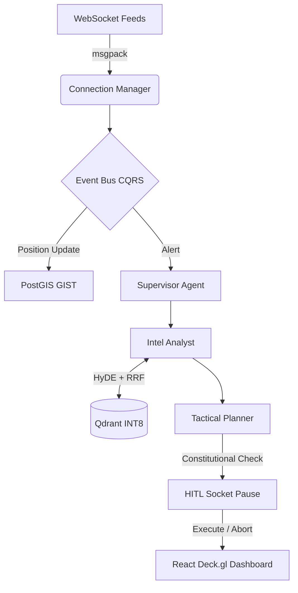

# Project Aegis-Grid
**Tactical Multi-Agent Geospatial Intelligence & Response System**

An air-gapped, multi-agent RAG system that fuses real-time geospatial intelligence, threat feeds, and operational doctrines to autonomously coordinate tactical drone swarms and ground units in GPS-denied environments.

## 🦅 IRON PROTOCOL - Architectural Blueprint

This repository is built under the strict and uncompromising engineering standards of the IRON PROTOCOL.
Aegis-Grid represents the bleeding-edge intersection of Agentic AI, Contested Environments, Multi-Domain Data Fusion, and Zero Trust Architecture.

### Core Architecture (Hexagonal DDD + CQRS)
- **Domain Driven Design (DDD)**: Strictly bounded contexts (`agent`, `c2`, `geospatial`, `threat`).
- **Hexagonal Architecture**: Business logic isolated completely from frameworks through explicit adapters.
- **CQRS**: Reads and writes are completely decoupled through an internal async pub/sub Event Bus.
- **Saga & Circuit Breaker**: Distributed interactions employ exponential backoff with jitter and automated recovery cycles.

### Multi-Agent Intelligence (LangGraph BDI)
- **BDI Model**: Agents operate strictly on Beliefs, Desires, and Intentions.
- **ReAct & Reflexion**: Agents critique their own output and regenerate if confidence falls below thresholds (<0.9).
- **Constitutional AI Check**: Tactical plans are run against Rules of Engagement (ROE) before human-in-the-loop (HITL) presentation.
- **SQLite Checkpointing**: LangGraph pauses execution, serializes the BDI state, and waits for WebSocket confirmation.

### Advanced RAG Pipeline
- **RAG Fusion & RRF**: Generates sub-queries, runs parallel searches, and merges using Reciprocal Rank Fusion.
- **HyDE**: Hypothetical Document Embeddings for robust search.
- **Semantic Chunking & Contextual Compression**: Extracts only mathematically relevant sentences from retrieved chunks.
- **Qdrant Scalar Quantization**: Optimized INT8 vector retrieval for edge deployment.

### Complex Geospatial Mathematics
- **Haversine & Vincenty**: For highly precise curved-surface distances.
- **A* & Theta***: Grid-based and any-angle pathfinding for tactical swarm routing.
- **Graham Scan & Ray Casting**: For geofenced inclusion zones and dynamic patrol boundaries.
- **DBSCAN**: Enemy cluster formation detection.
- **Kalman Filter**: Live 1D/2D smoothing for noisy GPS coordinates under jammed conditions.

## 📡 Live Pipeline & System Design

## 🚀 Setup & Execution
1. Install Docker & Docker Compose
2. Run `docker-compose up --build`
3. Navigate to `http://localhost:3000`

## 🛡️ Zero Trust Security
- **RBAC**: OBSERVER, ANALYST, COMMANDER, SUPERADMIN roles.
- **JWT**: Secure token issuance.
- **Strict Pydantic schemas**: Zero string interpolation.

> Note: Designed for demonstration and architectural study of advanced tactical AI systems.
